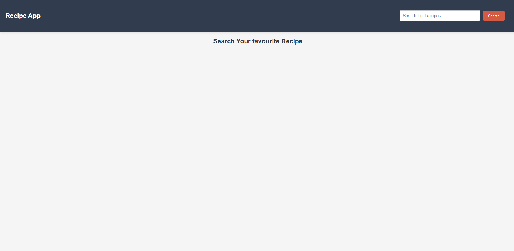
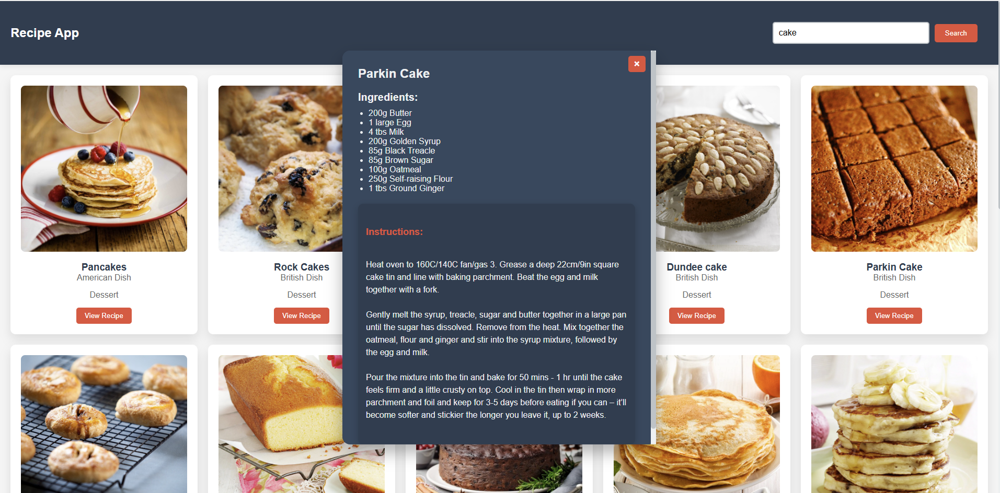
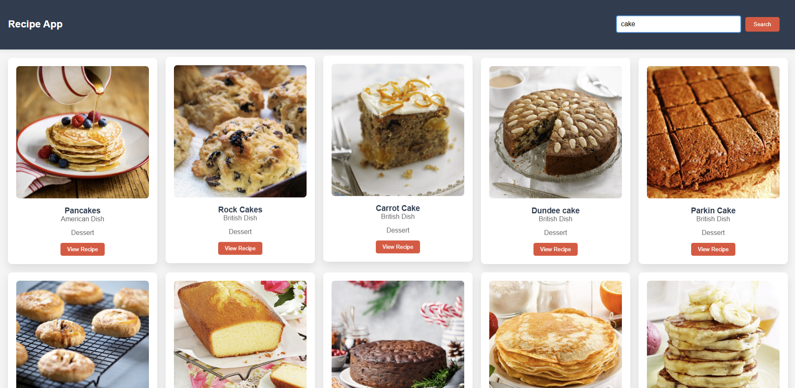

# Recipe App

A modern web application for searching and viewing detailed recipes using [TheMealDB API](https://www.themealdb.com/).

## Screenshots 📸
 


## Features
- **Search recipes by name**: Quickly find recipes based on the entered dish name.
- **Recipe cards**: View essential details including:
  - Recipe image
  - Dish name
  - Cuisine type
  - Category
- **Detailed recipe view**:
  - Full ingredients list with precise measurements.
  - Step-by-step cooking instructions.
- **Responsive design**: Works seamlessly on devices of all sizes.
- **Modern UI with animations**: Enjoy smooth and visually appealing interactions.

## Project Structure
- `index.html`: Main HTML structure of the app.
- `style.css`: CSS styling with a modern design.
- `script.js`: JavaScript functionality for interactivity.

## Technology Stack
- **HTML5**
- **CSS3** with Flexbox/Grid for layout.
- **Vanilla JavaScript** with async/await for API interactions.
- **TheMealDB API** for fetching recipe data.
- **Font Awesome icons** for UI enhancements.

## Setup
1. Clone the repository:
   ```bash
   git clone https://github.com/AnimeshNilawar/Recipe-Website.git
2. Open the `index.html` file in a web browser to run the app.

# Key Components

## JavaScript Functions
  - `fetchRecipe`: Fetches recipes from TheMealDB API.
  - `fetchIngredients`: Extracts ingredients and measurements from recipe data.
  - `openRecipePopup`: Displays a detailed recipe view in a popup.

## Styling Highlights
  - Responsive grid layout.
  - Hover animations for interactive elements.
  - Custom scrollbar for a polished user experience.
  - Modern color scheme for aesthetics.

## API Usages
This app utilizes TheMealDB API's search endpoint to fetch recipes dynamically.

## License
This project is licensed under the [MIT License.](https://choosealicense.com/licenses/mit/)
